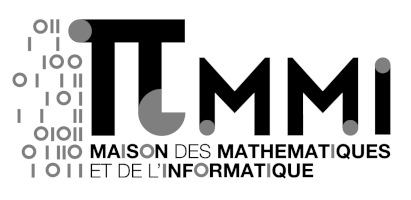
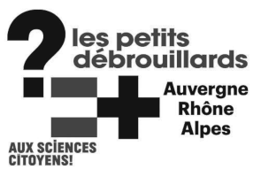

# Activité Marelle : aider Alan Turing à prendre le train

**Tranches d'âges :**

**Thématiques :**

**Résumé :**

Ce dépôt contient :
- une [fiche thématique](fiche-thematique.md)
- une [fiche activité](fiche-activite.md)
- les [contenus à imprimer](contenu/impressions-marelle-de-turing.pdf)

## A propos

Cette animation "débranchée" (sans ordinateur) a été imaginée dans le cadre du Week-End de Création d’Actions de Médiation (WECAM) autour d’Alan Turing, organisé par la Maison des Mathématiques et de l’Informatique (MMI) de Lyon en février 2022. 

**Attribution :**
Nina Gasking, Jairo Cugliari, Samuel Braikeh, Maison des Mathématiques et de l’Informatique, association Les Petits Débrouillards Auvergne-Rhône-Alpes.

**Les supports de l’activité MARELLE (fiche thématique, fiche activité, fiches et cartes à imprimer) sont sous licence Creative Commons [CC-BY-NC-SA 3.0 FR](https://creativecommons.org/licenses/by-nc-sa/3.0/fr/).**

La réutilisation de cette activité dans un cadre pédagogique et gratuit est libre, à la condition de citer de manière explicite (écrite ou orale) les auteur⋅e⋅s de l’activité.

Pour les réutiliser dans un cadre commercial, envoyez-nous un mail pour échanger.

