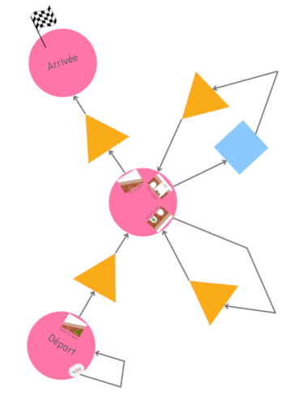
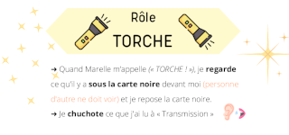
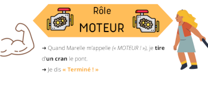
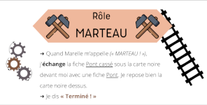

# Fiche activité Jeu de la MARELLE – machine de Turing

Pour public familial 5 à 10 ~15 personnes

Durée 30min

Un.e ou deux médiateur.ice.s pour animer l’activité

**Résumé**

## Objectifs

- Lire un graphe orienté
- Identifier les différents « organes » de la machine de Turing
- Découvrir le nom d’un des pionniers des ordinateurs : Alan Turing
- Observer que la machine « répare » le pont dans des situations où il est cassé de façon différente (la même « dynamique » permet de calculer des choses différentes)

## Matériel nécessaire

- sol sur lequel on peut dessiner à la craie
- idéalement : deux chariots
- fiches avec les rôles 
    - rôle Marelle
    - rôle Torche
    - rôle Marteau
    - rôle Moteur (x2)
- des cartes A3 ou A4 plastifiées recto-verso :
    - rail sur le sol
    - pont qui monte
    - pont qui descend
    - recto-verso pont / pont cassé
    - la nuit
- accessoires :
    - marteau (en bois, en plastique)
    - lampe torche ou lampe frontale
- accessoire bonus :
    - petit wagon à roulette
    - personnage d’Alan ou train

---
## Préparation de l’activité

Dessiner la marelle (voir Figure 1) au sol, à l’aide de grosses craies ou de craie en bombe (spray). Une personne doit pouvoir se tenir à l’intérieur des cases carré bleu, triangle rouge, cercle vert. Si vous n’avez pas les couleurs indiquées, faites attention à modifier les instructions pour la personne qui aura le rôle « marelle ».

[Figure 1. Schéma de la marelle à dessiner (cliquer pour voir en grand)](contenu/marelle-schema.png)

A environ une 10aine de mètres, disposer les cartes du rail entre Londres et Cambridge au sol (voir Figure 2). 

Figure 2. Cartes *chemin de fer* (disposition de départ)

---
## Déroulé détaillé de l’activité

### 1. Introduction

(devant les cartes de la voie ferrée)
Élements de la situation de départ :
Alan Turing est un mathématicien, qui veut se déplacer de Londres à Cambridge, en Grande-Bretagne.
Pour cette traversée il choisit de prendre le train.
Mais la nuit arrive, et une tempête va détruire des parties du pont.
Heureusement, nous avons un programme qui répare les ponts.
C’est le public qui va jouer le rôle de la tempête, et le rôle de l’équipe de réparation.

### 2. Formation des équipes

Nous avons besoin de faire deux équipes :
 - une équipe "tempête" qui va souffler sur le pont (*préparer les données d'entrée)
 - une équipe "cheminote" de 5 personnes qui va parcourir les rails, inspecter et réparer le pont avant le départ du train. L’équipe "cheminote" se déplace vers la marelle, pour être briefée, et ne pas voir ce que fait l’équipe "tempête".

Le nombre de personnes pour l’équipe "tempête" n’est pas décisif, il peut y avoir 5 personnes idéalement.

Chaque équipe reçoit ensuite ses instructions.

### 3.1. Instructions pour l’équipe "tempête"

Décider collectivement quelles cartes **pont** sont remplacés par une carte **pont cassé**. 
On ne peut pas détruire les rails avant et après le pont, ni les parties en pente, qui sont très solides. 

Remarque : Pour bien comprendre le mécanisme du jeu, il est préférable de ne pas détruire toutes les piles de pont.

Ensuite, recouvrir toutes les cartes avec les cartes "nuit".

Un exemple de ces étapes avec les figures suivantes :

Figure x. Le chemin de fer après le passage de la tempête

Figure x. Cartes *chemin de fer* (la nuit est tombée)

### 3.2. Instructions pour l’équipe "cheminote"

Chaque personne a un rôle et des consignes définies, qu’on explique à l’oral et qui 	sont rappelées sur les cartes "équipe cheminote" qui sont distribuées.

rôle marelle :

rôle torche :

rôle moteur (x2) :

rôle marteau :

On précise que c’est "marelle" qui lancera le jeu.

### 4. Jeu de la Marelle

L’équipe "cheminote" prend place. Pour commencer à jouer, "marelle" effectue un premier déplacement. Le jeu prend fin lorsque "marelle" arrive sur la case de fin.

Les autres personnes observent.

L’animateur⋅trice peut donner des alertes mais essaie de garantir que les règles du jeu soient respectées.

### 5. Deuxième trajet

Il s’agit de recommencer en formant deux nouvelles équipes "tempête" et "cheminote", en redonnant les instructions nécessaires à chacune, et en rejouant le jeu de la Marelle jusqu’à ce que le pont soit réparé une seconde fois.
**expliquer pourquoi : vivre l’expérience de l’intérieur et de l’extérieur

### 6. Retour, bilan

Qu’est-ce qu’un algorithme : début, fin, règles du jeu

Qui a réparé le pont ?

Le calcul se fait grâce aux différents éléments.

Peut-on toujours réparer le pont ? Même si cette pile de pont est cassée ? Ou celle là ?

---
## Remarques / Adaptations possibles
Alternative au dessin à la craie : il est possible d’utiliser des cerceaux / carrés / triangles colorés pour leset de la ficelle pour les flèches.

Faire dessiner la marelle par les participant.e.s
Les feuilles peuvent s’envoler, prévoir de petits poids.