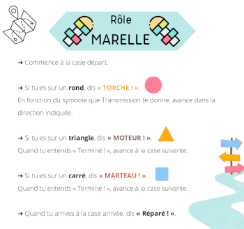

# Fiche activité Jeu de la MARELLE – machine de Turing

Pour public familial 5 à 10 ~15 personnes

Durée 30min

Un.e ou deux médiateur.ice.s pour animer l’activité

## 1. Matériel nécessaire

- sol sur lequel on peut dessiner à la craie
- idéalement : deux chariots
- fiches avec les rôles 
    - rôle Marelle
    - rôle Torche
    - rôle Marteau
    - rôle Moteur (x2)
- des cartes A3 ou A4 plastifiées recto-verso :
    - rail sur le sol
    - pont qui monte
    - pont qui descend
    - recto-verso pont / pont cassé
    - la nuit
- accessoires :
    - marteau (en bois, en plastique)
    - lampe torche ou lampe frontale
- accessoire bonus :
    - petit wagon à roulette
    - personnage d’Alan ou train

## 2.Objectifs

- Lire un graphe orienté
- Identifier les différents « organes » de la machine de Turing
- Découvrir le nom d’un des pionniers des ordinateurs : Alan Turing
- Observer que la machine « répare » le pont dans des situations où il est cassé de façon différente (la même « dynamique » permet de calculer des choses différentes)

## 3. Préparation de l’activité

Dessiner la marelle (voir Figure 1) au sol, à l’aide de grosses craies ou de craie en bombe (spray). Une personne doit pouvoir se tenir à l’intérieur des cases carré bleu, triangle rouge, cercle vert. Si vous n’avez pas les couleurs indiquées, faites attention à modifier les instructions pour la personne qui aura le rôle « marelle ».

[Figure 1. Schéma de la marelle à dessiner (cliquer pour voir en grand)](contenu/marelle.png)

A environ une 10aine de mètres, disposer les cartes du rail entre Londres et Cambridge au sol (voir Figure 2). 

Figure 2. Cartes *chemin de fer* (disposition de départ)

